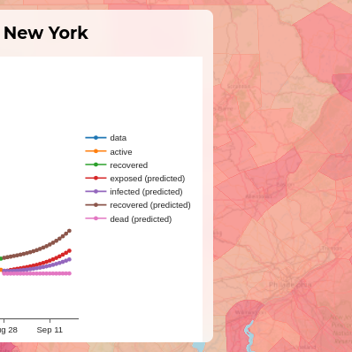
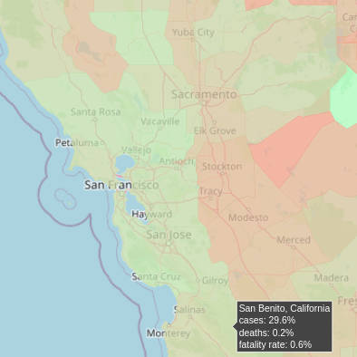

# covid-notebook

An interactive notebook for examining trends in confirmed COVID-19 cases

---




*Left: New York City, NY; Right: San Francisco, CA*

## What is it?

This project is an attempt to track the COVID-19 pandemic in the United States.
It uses data from the New York Times COVID-19 dataset and compiles that information into a series of choropleth maps with county-level detail.
Clicking on a county triggers historical data to load, at which point forecasts of possible future transmission can be generated.

## Is it ready yet?

Almost; the notebook needs to undergo a few changes before the production release, but as of right now no known bugs have been detected.
If you encounter an issue or have any suggestions, let us know by submitting an issue to this repository.

## How do I run it?

The notebook itself is simply a Dash app.
Since this isn't in production yet, there is no permanent website where the results are hosted, but the program can be installed and run locally at any time.

First, clone the repository and create a virtual environment:

```sh
git clone https://github.com/epispot/covid-notebook
cd covid-notebook
conda create -n epinote  # or, use pip if you prefer
```

Next, ensure that you are running Python 3.10 or later.
Due to certain new syntax introduced in 3.10, the app and relevant scripts will *not* work on older runtimes.
If you're using Anaconda, you can simply install the correct version of Python with:

```sh
conda install python==3.10.6
```

Finally, install all of the base requirements before starting the app:

```sh
pip install -r requirements.txt
```

You're all set! :rocket:

To run a sample instance for debugging, simply run `pythonn app.py`.
Otherwise, use `gunicorn` to start a production-ready server instance:

```sh
gunicron app:server
```
